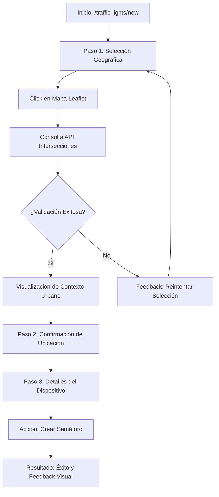

# UX Design Specification smart-city-bq-angular

**Author:** Jesus
**Date:** 2026-03-04

---

## Executive Summary

### Project Vision
Transformar la gestión de infraestructura urbana en una experiencia fluida y segura. Para la creación de semáforos, el sistema actúa como un asistente inteligente que guía al usuario y valida la ubicación en tiempo real, asegurando que cada dispositivo esté correctamente situado en una intersección válida antes de permitir su registro.

### Target Users
- **Administradores y Operadores Urbanos:** Personal que busca registrar dispositivos con precisión milimétrica sin necesidad de ser expertos en sistemas de información geográfica (GIS). Valoran la automatización de datos (barrio, ciudad) y la prevención de errores humanos.

### Key Design Challenges
- **Validación de Proximidad:** Encontrar la forma más clara de comunicar visualmente si el punto seleccionado está lo suficientemente cerca de una intersección válida.
- **Gestión de la Atención:** Mantener al usuario enfococado en una sola tarea a la vez (primero el mapa, luego los datos) para evitar errores de entrada.
- **Feedback en Tiempo Real:** Mostrar la información del endpoint (barrio, distancia) de forma inmediata tras la selección para dar seguridad al operador.

### Design Opportunities
- **Flujo Guiado (Stepper):** Implementar un asistente paso a paso (1. Mapa, 2. Validación, 3. Formulario) que estructure el proceso de creación de forma lógica.
- **Smart Pre-fill & Automation:** Utilizar el endpoint de intersección para "rellenar" automáticamente los datos de ubicación, redundando drásticamente el tiempo de carga manual.
- **Confirmación Visual Geográfica:** Usar el mapa para dibujar la distancia o un marcador de "ajuste" (snap) a la intersección más cercana, creando ese momento "Aha!" de precisión técnica.

---

## Core User Experience

### Defining Experience
La experiencia se centra en la **Validación Geográfica Asistida**. El núcleo es un flujo guiado (stepper) que transforma la compleja tarea de geolocalización en un proceso de tres pasos: Ubicación, Validación Técnica y Detalles Finales. El éxito se define cuando el operador siente que el sistema "entiende" la geografía urbana mejor que él.

### Platform Strategy
Aplicación Web tipo Dashboard optimizada para entornos de escritorio de centros de control. Se prioriza la precisión del puntero del mouse para la interacción con el mapa Leaflet y la visualización clara de datos técnicos en una pantalla de alta resolución.

### Effortless Interactions
- **Selección Geográfica con Feedback:** Al clicar en el mapa, el sistema consulta instantáneamente el endpoint de intersecciones.
- **Carga Automática de Contexto Urbano:** Relleno automático de campos de Barrio, Ciudad y Zona basándose en las coordenadas.
- **Navegación Lógica:** El stepper bloquea el avance si no hay una intersección válida cercana, actuando como una red de seguridad.

### Critical Success Moments
- **Confirmación de Intersección:** El instante en que el sistema muestra: "Intersección detectada: Calle X con Calle Y".
- **Visualización de Cercanía:** Ver en el mapa la relación física entre el punto marcado y la intersección real.

### Experience Principles
1. **Guiar, no solo Permitir:** El stepper conduce al usuario por el camino del éxito.
2. **Dato sobre Texto:** Priorizar la información obtenida del mapa frente a la entrada manual.
3. **Seguridad Técnica Visible:** Mostrar métricas (distancia en metros) para validar la decisión del operador.

---

## Desired Emotional Response

### Primary Emotional Goals
El objetivo primordial es que el operador sienta **Control Absoluto** y **Confianza Técnica**. Queremos transformar una tarea administrativa potencialmente propensa a errores en una experiencia de **Éxito Guiado**, donde el usuario se sienta asistido por una inteligencia urbana que le da seguridad en cada clic.

### Emotional Journey Mapping
- **Inicio:** Enfoque y claridad (Interfaz limpia, mapa prominente).
- **Acción (Click en Mapa):** Sorpresa positiva (Relleno automático de datos contextuales).
- **Validación:** Alivio y certeza (Confirmación visual de intersección cercana).
- **Cierre:** Orgullo profesional (Registro preciso y rápido del activo urbano).

### Micro-Emotions
- **Certidumbre:** "Sé que este semáforo está donde debe estar".
- **Flidez:** "El sistema trabaja para mí, no yo para el sistema".
- **Seguridad:** "Si cometo un error de ubicación, el sistema me avisará".

### Design Implications
- **Feedback de Proximidad:** Usar indicadores visuales (un radio de búsqueda en el mapa) para convertir la duda en certeza.
- **Mensajería Positiva:** Usar un lenguaje que valide la acción del usuario ("¡Perfecto! Hemos encontrado la intersección a 4m").
- **Visualización de Datos:** Presentar la información automática (Barrio/Ciudad) con una animación sutil para resaltar que el sistema está ayudando.

### Emotional Design Principles
1. **Validación sobre Interrogación:** El sistema confirma hechos, no solo hace preguntas.
2. **Asistencia Invisible:** La complejidad técnica de buscar la intersección ocurre en segundo plano para no abrumar.
3. **Claridad de Estado:** El usuario siempre sabe en qué punto del proceso está y si su acción actual es válida.

---

## UX Pattern Analysis & Inspiration

### Inspiring Products Analysis
- **Google Maps:** Referencia para la interacción con el mapa y la presentación de datos contextuales al seleccionar un punto.
- **Modern Steppers (ej. Stripe Onboarding):** Referencia para la división lógica de tareas complejas en pasos digeribles.
- **GIS Tools modernas (Mapbox/Uber):** Referencia para el comportamiento de "snapping" y precisión en la selección de coordenadas.

### Transferable UX Patterns
- **One-Thing-At-A-Time:** Cada paso del stepper se enfoca en una única validación (1. Dónde, 2. Qué hay ahí, 3. Detalles).
- **Auto-Fill contextual:** Al igual que en las apps de delivery, el sistema infiere la dirección/barrio tras la selección en el mapa.
- **Inline Validation:** Validar la cercanía a la intersección en tiempo real antes de permitir pasar al siguiente paso.

### Anti-Patterns to Avoid
- **Input Manual de Coordenadas:** Evitar que el usuario tenga que escribir números de latitud/longitud.
- **Validación al final del proceso:** No esperar a que el usuario termine todo el formulario para avisarle de un error geográfico.
- **Falta de Feedback Visual:** No dejar al usuario adivinando si el sistema está procesando la ubicación.

### Design Inspiration Strategy
- **Adoptar:** El "ajuste" visual del marcador a la intersección más cercana (inspirado en Uber).
- **Adaptar:** El concepto de stepper de Typeform, simplificándolo para un entorno técnico de Dashboard.
- **Evitar:** Cualquier flujo que requiera que el usuario memorice datos entre un paso y otro.

---

## Design System Foundation

### 1.1 Design System Choice
**Spartan UI (Brain/Hlm presets) con Tailwind CSS v4.** Utilizaremos los componentes de Spartan como base funcional, extendiéndolos con clases personalizadas de Tailwind para el flujo específico de geolocalización.

### Rationale for Selection
- **Consistencia:** Alineación total con el stack tecnológico ya establecido en el proyecto (`project-context.md`).
- **Velocidad de Implementación:** Uso de componentes pre-construidos para Steppers, Inputs y Botones, permitiéndonos enfocarnos en la lógica compleja del mapa y el endpoint.
- **Accesibilidad y Rendimiento:** Spartan UI sigue estándares WCAG AA, cumpliendo con los requisitos del PRD sin esfuerzo extra.

### Implementation Approach
- **Modularidad:** Cada paso del stepper será un componente independiente con su propia lógica de validación.
- **Signals-Driven UI:** El estado del formulario y la validez de la intersección se gestionarán mediante Angular Signals para asegurar una respuesta inmediata.
- **Leaflet Integration:** Integración directa de Leaflet para el componente de mapa en el Paso 1, usando capas base que contrasten bien con los componentes de Spartan.

### Customization Strategy
- **Branding Urbano:** Ajustar los tokens de color de Tailwind para reflejar una estética profesional de "Centro de Control" (tonos oscuros o azules corporativos).
- **Componentes Custom:** Creación de un "MapMarkerSelector" específico que encapsule la lógica de clic y consulta al API de intersecciones.
- **Feedback Visual:** Implementación de micro-interacciones (framer-motion o animaciones CSS nativas) para el paso entre etapas del stepper.

---

## 2. Core User Experience

### 2.1 Defining Experience
**"Click & Validate"**: La interacción central es la selección de un punto en el mapa Leaflet que dispara una validación automática contra el API de infraestructura urbana. El sistema no solo registra una coordenada, sino que valida la existencia de una intersección cercana, garantizando la integridad de los datos desde el primer paso.

### 2.2 User Mental Model
El usuario opera bajo un modelo de **"Gestión por Esquinas"**. Para el operador, un semáforo no existe en el vacío, sino en relación con un cruce de calles. El diseño traslada esta lógica mental a la interfaz, eliminando la necesidad de que el usuario conozca datos administrativos (barrio, zona) de antemano.

### 2.3 Success Criteria
1. **Feedback Inmediato:** El sistema responde a la selección en el mapa en menos de un segundo.
2. **Validación Visual:** El usuario ve una línea o radio de acción que conecta su clic con la intersección real detectada.
3. **Cero Duplicidad:** El sistema pre-rellena todos los datos geográficos, evitando errores de tipografía o inconsistencias en los nombres de calles/barrios.

### 2.4 Novel UX Patterns
Combinación de un **Stepper de Spartan UI** con un patrón de **"Geographic Snapping"**. Mientras que el stepper proporciona una estructura familiar, el snapping en el mapa introduce una capa de inteligencia que asiste al usuario en la precisión técnica de la ubicación.

### 2.5 Experience Mechanics
1. **Paso 1 (Mapa):** Selección de punto geográfico. Feedback visual de búsqueda.
2. **Paso 2 (Validación):** Presentación de datos del endpoint (Barrio, Ciudad, Distancia). Confirmación explícita del cruce detectado.
3. **Paso 3 (Datos Finales):** Formulario pre-rellenado para atributos específicos del dispositivo (Modelo, estado, notas).
4. **Cierre:** Animación de éxito y redirección al listado general de semáforos con el nuevo activo resaltado.

---

## Visual Design Foundation

### Color System
Basado en una estética de **Centro de Control Urbano**. Utilizaremos la paleta extendida de Tailwind v4:
- **Primary:** `slate-900` para fondos y `blue-600` para acciones principales (botones, pasos activos).
- **Success:** `emerald-500` para confirmaciones de intersección y validaciones geográficas.
- **Neutral:** `slate-200` y `slate-300` para textos secundarios y bordes.
- **Surface:** `white` con sutiles sombras (`shadow-sm`) para los paneles del stepper sobre el mapa.

### Typography System
Utilizaremos una escala tipográfica **Sans-Serif Moderna** (Geist o Inter):
- **Headings:** Bold y compactos para los títulos de los pasos del stepper.
- **Body:** `text-base` (16px) para formularios, con una versión `text-sm` (14px) para etiquetas técnicas y coordenadas.
- **Monospaced:** `font-mono` para la visualización de coordenadas lat/lng, reforzando la sensación de precisión técnica.

### Spacing & Layout Foundation
- **Grid:** Sistema de 12 columnas. El mapa ocupará 8 columnas y el panel del stepper 4 columnas (en pantallas grandes).
- **Spacing Unit:** Base de 4px. Gaps estándar de 16px (`gap-4`) entre campos de formulario y 24px (`gap-6`) entre secciones del stepper.
- **Container Strategy:** El panel del stepper se presentará como una tarjeta flotante o lateral con bordes redondeados (`rounded-xl`), creando una separación visual clara del mapa Leaflet de fondo.

### Accessibility Considerations
- Cumplimiento de **WCAG AA** en todos los contrastes de texto sobre fondo.
- Gestión de foco clara: al avanzar en el stepper, el foco se moverá automáticamente al primer campo interactivo del nuevo paso.
- Soporte para navegación por teclado en la selección de puntos del mapa (usando teclas de dirección si es necesario).

---

## Design Direction Decision

### Design Directions Explored
Se exploraron tres direcciones principales:
1. **Floating Command:** Panel translúcido sobre el mapa (Estética minimalista).
2. **Immersive Map:** Pantalla completa con controles inferiores (Enfoque en visualización).
3. **Sidebar Hub:** Estructura de panel lateral para datos técnicos (Enfoque en precisión).

### Chosen Direction
**Híbrido Sidebar Hub + Floating Context.** El layout se dividirá en un área principal de mapa (8/12 columnas) y un panel lateral derecho (4/12 columnas) que contendrá el Stepper de Spartan UI. Se añadirán elementos flotantes sobre el mapa para feedback inmediato (tooltips de distancia).

### Design Rationale
- **Claridad de Datos:** El panel lateral permite mostrar el formulario detallado del Paso 3 sin tapar la ubicación en el mapa.
- **Ergonomía:** Facilita la lectura de datos técnicos mientras se mantiene la referencia visual geográfica a la izquierda.
- **Fit Tecnológico:** Se alinea perfectamente con la estructura de componentes de Spartan UI y Tailwind CSS v4.

### Implementation Approach
- **Layout Responsivo:** En dispositivos móviles, el panel lateral se transformará en una hoja inferior (bottom sheet) para mantener la usabilidad.
- **Componentes:** Uso de `HlmStepper` para la navegación y `HlmCard` para el panel lateral.
- **Interacción:** Sincronización mediante Angular Signals entre el marcador del mapa Leaflet y el estado de validación en el panel lateral.

---

## User Journey Flows

### Creación Asistida de Semáforo
Este flujo describe la interacción principal del operador para registrar un nuevo dispositivo, integrando la validación geográfica en el corazón del proceso.

### Journey Patterns
- **Entry Points:** Acceso directo desde el dashboard principal o la lista de semáforos.
- **Decision Points:** El usuario decide si la intersección detectada es la correcta o si desea reintentar la selección.
- **Feedback Patterns:** Uso de "Toasts" para errores y "Confetti/Checkmarks" para el éxito final.

### Flow Optimization Principles
1. **Reducción de Pasos:** El auto-relleno de datos (Barrio, Ciudad) elimina la necesidad de 4-5 entradas manuales.
2. **Prevención de Errores:** Bloqueo del avance del stepper hasta que la validación geográfica sea positiva.
3. **Contexto Persistente:** El mapa siempre es visible, manteniendo el contexto espacial durante todo el registro.

---

## Component Strategy

### Design System Components
Utilizaremos la suite de **Spartan UI** para todos los elementos de interfaz estándar, asegurando coherencia visual y accesibilidad nativa:
- **Navegación:** `HlmStepper` para guiar el proceso de 3 pasos.
- **Estructura:** `HlmCard` para el panel lateral de control (Sidebar Hub).
- **Entrada de Datos:** `HlmInput`, `HlmSelect` y `HlmLabel` para los detalles técnicos del semáforo.
- **Feedback:** `HlmSkeleton` para estados de carga y `HlmAlert` para errores de validación geográfica.

### Custom Components
Diseñaremos componentes especializados que extienden la funcionalidad de Spartan UI con lógica geoespacial:

#### TrafficMapSelector
- **Purpose:** Punto de interacción principal para la geolocalización.
- **Usage:** Paso 1 del Stepper.
- **Interaction Behavior:** Captura clics en el mapa Leaflet, dispara la lógica de "Snapping" y emite coordenadas validadas mediante Angular Signals.

#### IntersectionValidatorCard
- **Purpose:** Presentación clara de los datos obtenidos del endpoint de infraestructura.
- **Anatomy:** Indicador de estado (Icono), Lista de atributos (Barrio, Ciudad, Distancia) y Acción de confirmación.
- **States:** `Searching`, `ValidLocation`, `InvalidLocation`.

### Component Implementation Strategy
- **Lógica desacoplada:** Los componentes custom de mapa no conocerán la lógica del stepper; se comunicarán mediante un servicio de estado compartido basado en Signals.
- **Estilo:** Se aplicarán las clases de Tailwind CSS v4 para asegurar que los componentes custom se sientan parte orgánica de la suite de Spartan UI.

### Implementation Roadmap
1. **Paso 1:** Esqueleto del Stepper + Mapa interactivo.
2. **Paso 2:** Lógica de validación + Tarjeta de información de intersección.
3. **Paso 3:** Formulario reactivo final + Integración de guardado.

---

## UX Consistency Patterns

### Button Hierarchy
- **Primary Actions:** Botones prominentes (`hlm-btn solid`) para avanzar en el stepper ("Confirmar Ubicación") y finalizar la creación. Ubicación consistente en la base del panel lateral derecho.
- **Secondary Actions:** Botones de retroceso o cancelación en estilo `outline`, permitiendo al usuario corregir pasos anteriores sin distracciones visuales.

### Feedback Patterns
- **Validación Geográfica:** Uso de un radio de color verde (transparente) en el mapa que indica el área de búsqueda exitosa de la intersección.
- **Mensajería de Estado:** Implementación de "Toasts" para notificaciones rápidas y "Alerts" integradas en el stepper para bloqueos por validación (ej. "Intersección no encontrada").
- **Visual Confirmation:** Animación de "snap" del marcador a la intersección detectada para confirmar visualmente el éxito técnico.

### Form Patterns
- **Smart Fields:** Los campos obtenidos por el API (Barrio, Ciudad, Coordenadas) se presentan en estado `disabled` o `readonly` para evitar ediciones accidentales que rompan la integridad de los datos.
- **Input Focus:** Al avanzar al paso 3, el foco se coloca automáticamente en el primer campo editable (ej. "Nombre del Semáforo").

### Navigation Patterns
- **Stepper Flow:** Navegación lineal obligatoria. No se permite saltar al paso 3 sin haber validado la ubicación en el paso 2.
- **Mapa Persistente:** El mapa no desaparece; se mantiene como contexto visual de fondo, permitiendo al usuario reorientarse en cualquier momento.

---

## Responsive Design & Accessibility

### Responsive Strategy
- **Desktop First (Control Center):** Optimizado para la visualización de datos técnicos y precisión del mapa. Layout de panel lateral persistente.
- **Tablet Adaptive:** Uso de componentes `drawer` o `bottom-sheet` para los pasos del stepper, facilitando el uso táctil en inspecciones de campo.
- **Mobile Emergency:** Interfaz simplificada centrada en la ubicación geográfica y confirmación rápida.

### Breakpoint Strategy
Utilizaremos el sistema de rejilla de Tailwind v4 para transiciones fluidas:
- **< 1024px:** El panel lateral se oculta y se convierte en una capa superpuesta o inferior.
- **> 1024px:** Se activa el **Sidebar Hub** fijo para una experiencia de escritorio productiva.

### Accessibility Strategy (WCAG AA)
- **Focus Management:** Al avanzar en el stepper, el foco se desplaza al encabezado del nuevo paso para orientar a los usuarios de lectores de pantalla.
- **Semantic HTML:** Uso de etiquetas `<nav>` para el stepper y `<form>` para los detalles técnicos.
- **Color Contrast:** Asegurar la legibilidad de las etiquetas de distancia sobre las capas del mapa Leaflet.
- **ARIA Live Regions:** Notificación dinámica de los resultados de validación del endpoint de intersecciones.

### Testing Strategy
- **Automated:** Ejecución de tests Axe-core en el entorno de Vitest.
- **Manual:** Verificación de la navegación por teclado (Keyboard-only journey) para todo el flujo de creación.

### Implementation Guidelines
- **Unidades Relativas:** Uso de `rem` para tipografía y `spacing` para asegurar escalabilidad.
- **Touch Areas:** Incrementar el padding de los botones en dispositivos móviles usando clases condicionales de Tailwind.

---

